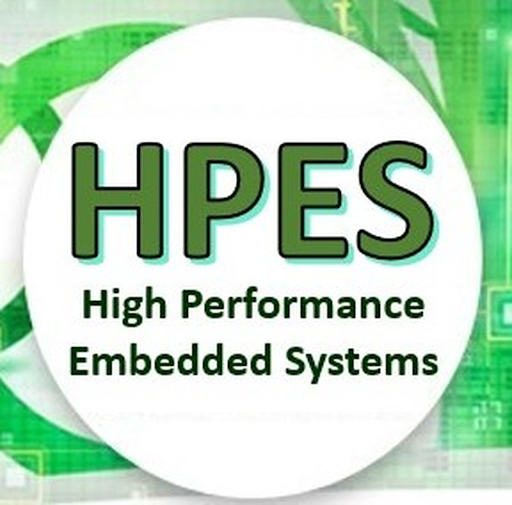

  

    
    
  

   
  <strong style="font-size: 1.4em;">EEE4120F – High Performance Embedded Systems (HPES)</strong>
   
  Department of Electrical Engineering, University of Cape Town
    
  

    
    
  

## Highlights & Introduction
This repository contains the code and documentation for the practicals for the  EEE4120F: High Performance Embedded Systems course, a honours level module in Electrical Engineering at the University of Cape Town (UCT).

## Repository Structure
The repository is organised as follows:
- Each practical has its own dedicated folder (e.g., `Practical 1`, `Practical 2`, etc.)
- Within each practical's folder, you will find:
  - The practical manual.
  - The practical tutorial
  - The practical skeleton's code.

## Practicals Overview
Each practical is geared to run concurrently with what is taught in class

| # | Description | Module |
| :--- | :--- | :--- |
| **1** | Benchmarking manual implementations against built-in MATLAB/Octave functions. | Introduction to Performance Benchmarking |
| **2** | Evaluating serial vs. parallel algorithms using the Parallel Computing Toolbox (PCT). | Parallel Computing Performance |
| **3** | Comparative analysis of Shared Memory vs. Distributed Memory parallel models. | Shared & Distributed Memory Systems |
| **4** | Introduction to HDL programming and simulation using Icarus Verilog (iverilog). | Hardware Description & FPGAs |
